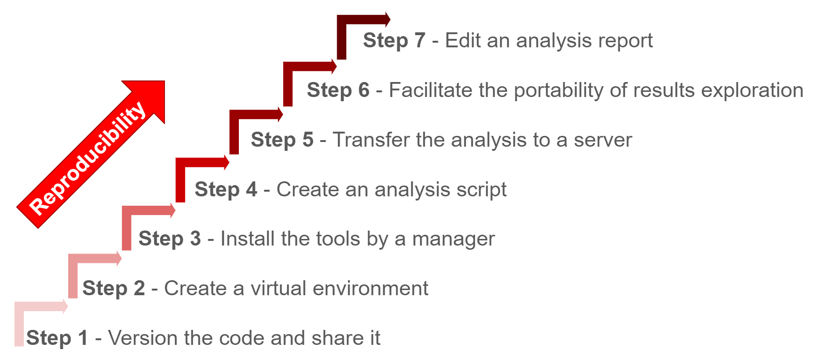

# Summary

Reproducibility plays an essential part in the success of a bioinformatics project. Indeed, Reproducibility makes it possible to guarantee the validity of scientific results and to simplify the dissemination of projects. To help disseminate Reproducibility principles among bioinformatics students, engineers and scientists, we created the FAIR_Bioinfo course, which presents a set of features we consider necessary to make a complete bioinformatics analysis reproducible. To illustrate the theoretical concepts of reproducibility, we use as an example a classic bioinformatics analysis (differential gene expression analysis from RNA-seq data). In short, we retrieve the data from public databases (ENA/SRA), we perform a reproducible analysis using a workflow management system (snakemake) in a virtual environment (Docker). The entire versioned (git) code is open source (Github https://github.com/thomasdenecker/FAIR_Bioinfo and dockerhub https://hub.docker.com/r/tdenecker/fair_bioinfo). The visualization of the results is dynamic (Shiny app) and the PDF or HTML report (Rmarkdown) provides the results of the analysis and lists all user-selected parameters.

# How to use

The whole example proposed in FAIR_Bioinfo can be simply reproduced with the following 4 command lines executed in a terminal (note that docker must be installed beforehand - https://www.docker.com/products/docker-desktop):

```
$ git clone https://github.com/thomasdenecker/FAIR_Bioinfo

$ cd FAIR_Bioinfo

$ sudo docker run --rm -d -p 8888:8888 --name fair_bioinfo -v ${PWD}:/home/rstudio tdenecker/fair_bioinfo

$ sudo docker exec -it fair_bioinfo bash ./FAIR_script.sh
```
Once the analysis is complete, the web application can be launched with the following command:

```
$ sudo docker exec -it fair_bioinfo bash ./FAIR_app.sh
```
and used by copying http://localhost:8888/rstudio/p/4444/ into your browser.

Note : The use of the `sudo` command is not necessary for Mac OS and Windows. The demonstrations of the course have been made on a Linux environment (Ubuntu 18.04).

# Statement of Need

Recent reanalyses of biology [@baker_monya_1500_2016] and computer science [@warren_repeatability_2015] papers found a staggering ratio of non-reproducible results. Our daily experience as bioinformaticians indicate the same issues exist in our field. It is therefore essential that good practices are implemented to ensure data integrity and reproducibility of analytical results. This course was created originally at the request of colleagues who wanted to be trained in reproducibility practices in their own language (French). This course was born from the combination of our personal experiences in reproducibility acquired during our research work in Bioinformatics. We therefore created and delivered a set of training sessions in French, including a complete workflow and associated course materials available on Github (https://github.com/thomasdenecker/FAIR_Bioinfo). Following positive initial feedback and at the request of our English-speaking colleagues, we decided to translate the workflow documentation to english and to convert it into a Gitbook document (https://fair-bioinfo.gitbook.io/fair-bioinfo/).

# Target audience

No prior computational skills are required to complete the entire course. This training is therefore adapted to biologists willing to gain autonomy in their bioinformatics analyses. For example, we start by showing how to open a terminal (under any of the Windows, MacOSX or Ubuntu OS). At the end of the session, participants are able to reproduce an entire bioinformatics analysis, which can be launched either on their personal computer or on a distant server (or computational cloud or cluster services).

# Learning Objectives and Content

In this FAIR_Bioinfo training, we present a stepwise protocol to ensure the reproducibility of Bioinformatics analysis and to guarantee identical results from the same data set and over time. For this reason, we extended the FAIR principles popular in the field of data management [@wilkinson_fair_2016] to propose FAIR principles for bioinformatics workflows:
- **F**indable: The tools used are references in their field (bowtie2, samtools, HTseq-counts, ...)
- **A**ccessible: Codes, slides, docker image are online (Github & Dockerhub)
- **I**nteroperable: The different tools will communicate with each other (conda & snakemake)
- **R**eusable / Reproducible: The workflow is saved in a file whose execution replays the entire analysis identically (Jupyter, Rmarkdown, ...)

Our protocol  is composed of seven main steps which application gradually increases the level of reproducibility (Figure 1).

**Figure 1** : The 7-step solution of FAIR_bioinfo [@FAIR_Bioinfo_Figure1]



To illustrate FAIR principles for bioinformatics workflows, we used a classic RNA-seq data analysis workflow. Starting from raw data (FASTQ files), this analysis aims to identify genes that are differentially expressed between different conditions. The underlying biology is not detailed, as our focus is on the reproducibility aspects rather than the specific bioinformatics protocol or biological question. Eventually, the RNA-seq analysis protocol used as an example here could be replaced by any other type of bioinformatics analysis.

# Instructor notes

The training course is divided into 8 sessions, each one bringing an additional level of reproducibility to the global workflow. Each session lasted an hour and a half ; they were carried out at the rate of one session per month. Table 1 shows the detailed program and learning objectives of each session.

**Table 1** : Overview of sessions

| Title         	| Session | Description | Tools |
|-------------------|---------|-------------|-------|
| This is not magic | 1   	| Open a terminal and retrieve data for the analysis pipeline (loop & variable concepts, bash command) | shell, wget, md5sum |
| The code memory   | 2   	| Initiation to code versioning | Git & Github |
| Play with analysis tools | 3   	| Implementation of a first part of the analysis pipeline from the fastq file to the count table | conda, third-party tools used for bioinformatics analysis (FastQC, bowtie2, samtools, HTseq-counts)  |
| A trip to the sea | 4 | Control the computing environment using a container and compute a cloud platform | Docker, ssh |
| I've got the power! | 5 | Parallel computing and use of a computer cluster | Snakemake, slurm, Singularity, ascp |
| LoveR | 6 | Upgrade to dynamic rendering using a web application and presentation of a few powerful R packages | Shiny, R packages |
| Sharing results and protocols using notebooks | 7 | Creating an analysis report and sharing it | Jupyter & Rmarkdown |
| Disseminate your project | 8 | Disseminate a reproducible project. Perspective for improvement | Githubpages, License, Release, Zenodo |

The slides of each session are available on the FAIR_Bioinfo github in French. They have been translated into English and inserted as figures in the Gitbook. English speaking instructors can very easily create slides from the Gitbook and these figures.

# Conclusion and Perspectives

We proposed a training course to help scientists improve their computational practice by ensuring reproducibility of bioinformatic analysis. The training course is divided into 8 sessions each introducing a core competence for reproducible analysis. We also address possible future developments (last session), including:
- Installing all tools in a Conda environment itself residing in a Docker image. The goal is to isolate the installation layer [@gruning_practical_2018]
- Setting up a Virtual machine to run the Docker container. The goal is to stand the test of time by also setting the Operating System.
- Implement continuous integration to ensure that code changes do not cause changes in results.

Through the FAIR_Bioinfo training, we offer users a solution to make Bioinformatics analyses entirely reproducible. All the tools used can be replaced by other equivalent solutions (docker by singularity, snakemake by nextflow,...). Thus, with FAIR data and protocols according to the principles of FAIR_Bioinfo, we obtain FAIR-processed data. This same data can be used again and again to enter a virtuous circle of reproducible analyses.

# References
